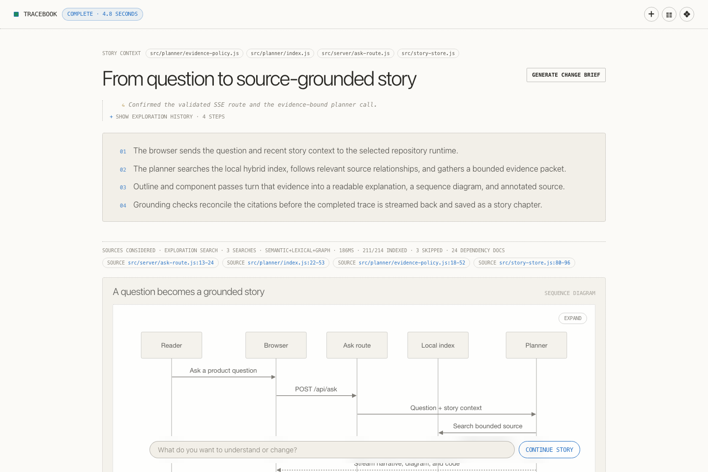
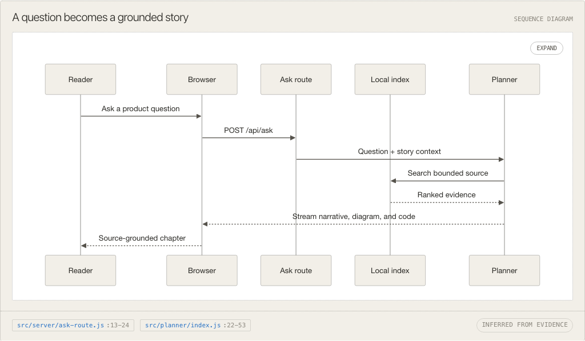
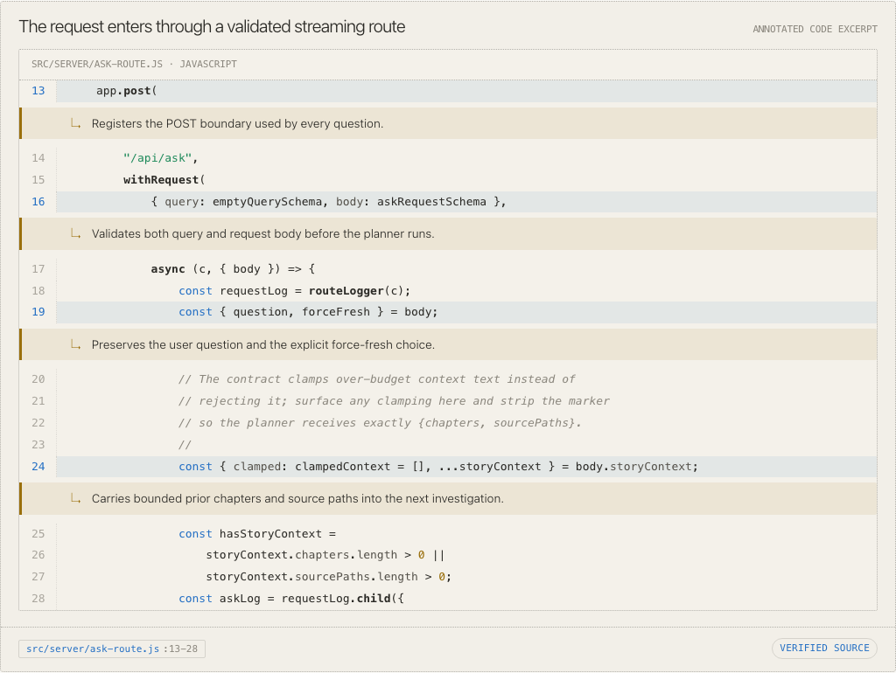
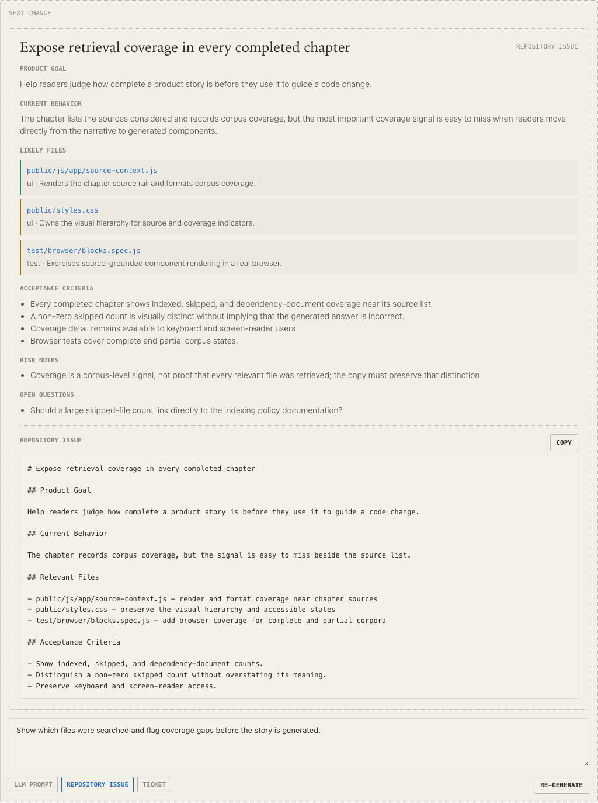
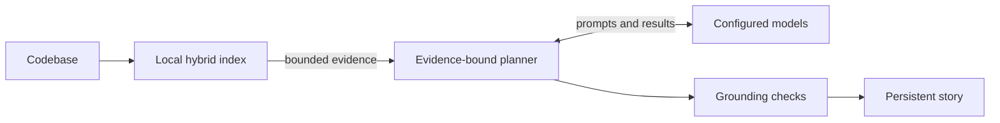

# Tracebook

Tracebook turns a codebase into source-grounded product stories: readable explanations, diagrams, and annotated code backed by the files in the repository.

[](docs/product-walkthrough.md)

*Ask a product question. Get a readable story grounded in repository evidence. [See the complete product walkthrough.](docs/product-walkthrough.md)*

Its working thesis is:

> Help me understand the product story well enough to ask an LLM for the right change without breaking something important.

Modern software is increasingly inherited, generated, and changed by people who did not write the underlying code. The difficult part is not only producing more code. It is understanding current behavior well enough to guide the next change.

Most people "writing code" will never read it, or understand all of it. Tracebook is for people who still need a checkable mental model before asking an engineer, an API model, or a local coding model to act.

## What Tracebook Produces

A question becomes a chapter in a persistent story rather than another disposable chat response. A chapter can combine:

- verbatim annotated source excerpts;
- sequence diagrams and other Mermaid figures;
- grounded or inferred evidence callouts;
- explicit coverage gaps when the repository does not support a claim; and
- source links that open the full file at the cited range.

| Follow behavior across boundaries | Inspect the exact source |
| --- | --- |
| [](docs/product-walkthrough.md#6-follow-behavior-across-boundaries-with-diagrams) | [](docs/product-walkthrough.md#7-inspect-annotated-source) |
| Diagrams turn multi-file behavior into a shared visual model without losing its citations. | Verbatim excerpts let readers understand the behavior and verify it against numbered source lines. |

Stories can continue through follow-up questions, be reopened from the story library, identify cited source that has changed, regenerate against the current repository, and produce a structured change brief. Expanded source can also be copied as a themed PNG rendered entirely in the browser.

<p align="center">
  <a href="docs/product-walkthrough.md#11-review-and-copy-the-change-brief">
    
  </a>
</p>

<p align="center"><em>Turn source-grounded understanding into a structured handoff for an engineer or coding model.</em></p>

At a high level, Tracebook keeps the path from source to explanation explicit:



## Network Last

Tracebook keeps the repository, derived search index, evidence selection, stories, traces, change briefs, and configuration under the user's control. Parsing, graph construction, hybrid retrieval, local reranking, Mermaid rendering, and code-image export run locally.

Network-last is not network-exclusive. Each generative workload can use Ollama or a supported API provider. A hosted role receives the bounded question, context, and source evidence required for that operation; it does not become Tracebook's repository mirror, search layer, or system of record. Missing model weights and Ollama models may also be downloaded on first use.

See [Design and Purpose](docs/design-and-purpose.md) for the product argument and [Architecture](docs/architecture.md) for the exact execution and data boundaries.

## Quickstart

Prerequisites:

- Node.js 24 or newer
- Yarn 4.x through Corepack
- Ollama models, provider credentials, or a mixture of both for the workloads you configure

Run Tracebook:

```sh
corepack enable
yarn install
yarn dev
```

Vite opens the loopback application in the browser. If it does not, open the local URL printed in the terminal.

Then:

1. Open `/admin`.
2. Review the model assignments, confirm the Ollama endpoint, and add credentials only for hosted roles.
3. Keep the included Tracebook repository or add other repositories by absolute path.
4. Open `/repos` and choose the codebase to explore.
5. Wait for the first local index to become ready, then ask what you want to understand or change.

The first run may download configured search or Ollama models and build a repository-specific index. Later runs reuse stored rows, and the watcher updates changed files incrementally.

See the [Product Walkthrough](docs/product-walkthrough.md) for a complete visual tour from setup and indexing through grounded stories, source inspection, follow-up chapters, and Change Briefs.

## Configuration and Data

`/admin` writes non-secret configuration to:

```text
~/.tracebook/tracebook.config.json
```

Provider credentials are stored in the operating-system keychain through `@napi-rs/keyring`, not in that JSON file. Repository-specific indexes, traces, stories, and change briefs live under:

```text
~/.tracebook/data/repos/<repo-hash>/
```

Local Hugging Face embedding and reranking weights use the shared `~/.bandf/models` cache. Ollama manages its own model store.

The HTTP server is deliberately loopback-only. Tracebook is a local application boundary, not a remotely exposed multi-user service.

See [Configuration](docs/configuration.md) for model workloads, resource tradeoffs, and the data each configured role receives.

## Common Commands

```sh
yarn dev                    # Run the local development application
yarn build                  # Build the client and production server bundles
yarn preview                # Build and run the production bundle locally
yarn lint                   # Run XO over the JavaScript codebase
yarn test                   # Run Node unit, functional, integration, and API tests
yarn test:browser           # Build the client and run the Playwright browser suite
yarn verify                 # Lint, run the Node test suite, and build both bundles
yarn docs:screenshots       # Rebuild the Product Walkthrough screenshots
yarn eval:smoke             # Run the routine retrieval and generation quality gate
yarn eval:retrieval         # Measure retrieval levers and production retrieval policy
yarn eval:retrieval:compare # Compare raw and expanded retrieval questions
yarn eval:generation        # Measure end-to-end grounded story generation
```

Model-backed evaluations are intentionally separate from `yarn verify` because they can require local model time, API calls, or persistent evaluation indexes.

## Documentation

- [Product Walkthrough](docs/product-walkthrough.md) — illustrated tour of the complete Tracebook workflow
- [Design and Purpose](docs/design-and-purpose.md) — why the product exists and the ideas it demonstrates
- [Architecture](docs/architecture.md) — runtime topology, data flow, persistence, grounding, and trust boundaries
- [Configuration](docs/configuration.md) — admin-owned settings, model roles, resource pressure, and model input
- [Indexing](docs/indexing.md) — corpus policy, language knowledge, hybrid retrieval, and source revisions
- [Retrieval Evaluation](docs/retrieval-eval.md) — measuring whether the right source enters evidence
- [Generation Evaluation](docs/generation-eval.md) — measuring whether stories remain grounded in that evidence

## License

Tracebook is licensed under the GNU Affero General Public License v3.0. See [LICENSE.md](LICENSE.md).
