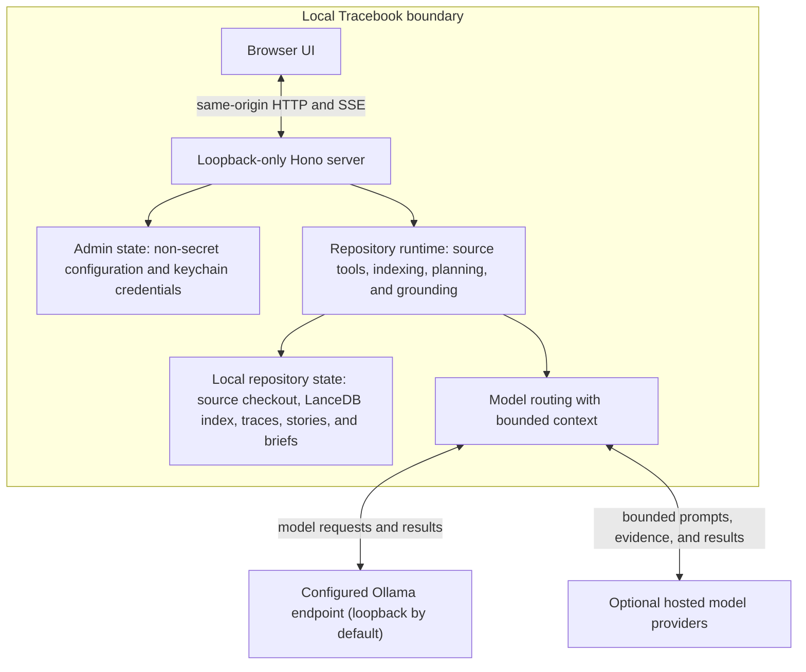
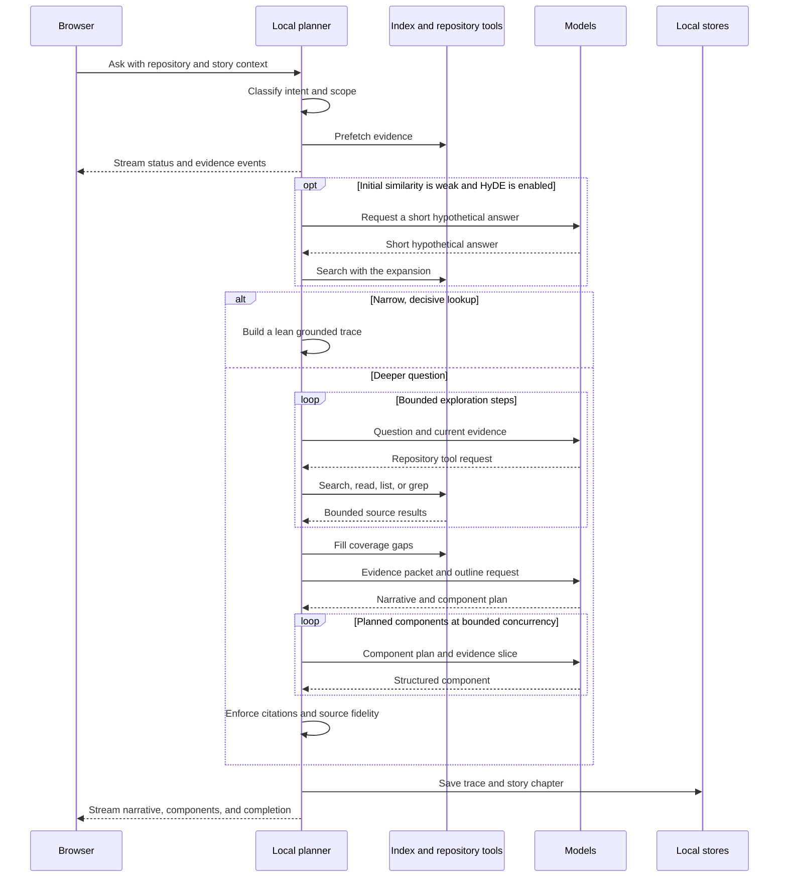
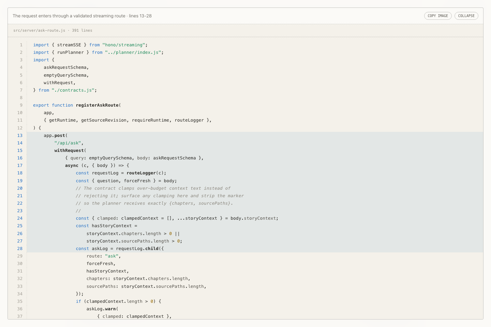

# Architecture

Tracebook is a browser application backed by a single local Node.js process. The server reads configured repositories, owns their search and story state, orchestrates model work, and streams grounded results to the browser. It is not a hosted repository service: the source checkout and the derived product state remain under the user's control.

## System at a Glance



The browser is responsible for presentation and interaction. The server is responsible for repository access, model orchestration, grounding, persistence, and runtime lifecycle. Model providers are interchangeable execution targets inside that architecture; they do not own Tracebook's repository or state.

## Application Surfaces

The application has three browser routes:

- `/admin` is the authoritative setup and configuration surface.
- `/repos` selects one of the configured repositories.
- `/` and `/<story-id>` host the story interface, including direct links to saved stories.

The browser sends the selected repository id in an `x-tracebook-repo` header. The server resolves that id against the admin configuration and creates or reuses an isolated runtime for the corresponding absolute path.

The story interface is implemented as browser modules and custom elements rather than a client framework. It streams planner events into a chapter, renders source-aware components, maintains the chapter and source rails, saves completed stories, and exposes the story library, regeneration, themes, and change-brief workflow.

## Configuration and Startup

Importing the runtime configuration resolves the Tracebook paths and ensures the application directory and per-repository data root exist. Until the admin has saved a configuration file, runtime endpoints return `setup_required` and the browser directs the user to `/admin`.

Saving admin configuration performs four operations:

1. Validate the complete effective configuration, including model/provider compatibility and required credentials.
2. Store provider credentials in the operating-system keychain.
3. Atomically replace the non-secret JSON configuration file.
4. Reload configuration and dispose existing repository runtimes so the next use starts them with the new settings.

Starting a repository runtime then:

1. verifies required Ollama models and pulls missing ones through the configured Ollama endpoint;
2. verifies that the repository exists and is readable;
3. opens the trace, story, and change-brief stores;
4. loads the embedding model and opens the repository's index;
5. builds or refreshes the index;
6. starts the source watcher;
7. creates repository tools, the answer cache, trace retrieval, and the optional reranker; and
8. warms local inference before reporting the runtime ready.

The browser polls sanitized runtime status and presents model acquisition, storage initialization, indexing, and errors as explicit startup states. Process shutdown closes the HTTP listener and disposes watchers, LanceDB connections, tokenizers, and ONNX sessions.

## Repository Isolation and Storage

Tracebook does not write generated artifacts into the analyzed checkout. Its canonical application paths are:

```text
~/.tracebook/
  tracebook.config.json
  data/
    repos/
      <repo-hash>/
        index/
          <embedding-signature>/
        traces/
        stories/
        change-briefs/
```

The repository hash is derived from the resolved absolute repository path. The embedding signature separates indexes that use different embedding models or dimensions. Repository paths remain in the admin configuration; they are not used as directory names in the data tree.

Traces, stories, and change briefs are JSON-per-id stores. Writes use a unique temporary file followed by an atomic rename, and each store serializes its own mutations. Traces retain compact replay events and the generated feature trace. Stories retain chapters, source paths, and source fingerprints. Change briefs retain the structured handoff generated from a completed trace.

Two model stores sit outside this tree:

- local Hugging Face embedding and reranking weights use the shared `~/.bandf/models` cache;
- Ollama owns its own model storage and lifecycle.

These are reusable model assets rather than repository-specific Tracebook state.

## Building the Repository Knowledge Layer

The indexer begins with a corpus policy, not an unrestricted directory walk. It combines built-in source rules with `.gitignore`, `.ignore`, and `.tracebookignore`, rejects paths that escape the repository, excludes binary and oversized files, and admits supported source and repository artifacts through the language-integration registry.

For each admitted file, the indexer can produce:

- line-addressable source chunks;
- embedding text specialized for code retrieval;
- parser-backed graph facts such as definitions, imports, routes, configuration access, storage operations, and entrypoints;
- dependency relationships used for callers, dependencies, and architectural hubs; and
- an optional product-language enrichment document generated from the relative path and a bounded prefix of the file.

Dependency manifests can also produce virtual documents under paths such as `__dependencies__/npm/hono.md`. These describe declared runtime dependencies without indexing installed dependency trees.

The local LanceDB store combines vector search, BM25 full-text search, file and line metadata, content hashes, and source-graph rows. Retrieval fuses semantic and lexical results, adds supporting repository artifacts, and can rerank the leading candidates with a local Hugging Face cross-encoder.

An index fingerprint covers the indexing scheme, chunking settings, graph and embedding-text versions, file-size limit, enrichment configuration, and the embedding model's document-side behavior. A relevant change invalidates stored content hashes so the next indexing pass recomputes affected rows cleanly.

After a full or incremental update, the indexer derives a source revision from the sorted set of indexed paths and their content hashes. The watcher advances this revision as files change. Answer-cache entries, similar traces, stories, and change briefs use revisions or source fingerprints to avoid presenting old evidence as current.

## From Question to Chapter

The planner is a phased event generator. Its output is sent to the browser over server-sent events and collected into a persistent trace.



Intent classification distinguishes narrow source location, behavioral explanation, visual explanation, and broader system questions. It also separates the current retrieval question from prior story context so a follow-up can inherit useful meaning without allowing the previous chapter to dominate search.

Prefetch runs local hybrid retrieval before the exploration model. If the first result is weak and HyDE is enabled, the configured HyDE model generates a single short hypothetical answer that is embedded as a document-side query. Narrow, decisive lookups can take a lean path without the full exploration and component pipeline.

For deeper questions, the exploration model receives the question, bounded story context, and the prefetched evidence. It can call only the repository-scoped search, read, list, and grep tools. Tool steps, returned content, wall-clock time, and token use are bounded by configuration.

Coverage then checks whether a multi-file question has enough evidence. It can issue focused retrieval queries for missing stages and, for system overviews, add highly connected import-graph hubs. This reduces the tendency to explain only the first plausible file.

The outline model streams the chapter title and narrative while producing a typed component plan. Deterministic augmentation ensures that explicitly requested code, diagrams, API surfaces, and supporting actors are represented when evidence permits. Component synthesis then runs with bounded concurrency over evidence slices rather than giving every component the complete working set.

The supported rendered components are:

- `annotated_code_excerpt`
- `mermaid_figure`
- `sequence_diagram`
- `evidence_callout`

If a component cannot be produced safely, its slot can degrade into a visible coverage gap while other components continue.

## Grounding and Trust Boundaries

The repository remains the authority for source claims. Model output passes through deterministic enforcement before becoming a completed component:

- request bodies, route parameters, and generated objects are schema-validated;
- repository tools and source preview share path and corpus boundaries;
- evidence carries repository-relative paths and bounded line ranges;
- component citations must come from evidence supplied to that component;
- cited ranges are clamped to retrieved source boundaries;
- annotated code is checked against the source and repaired or replaced when it is not verbatim; and
- unsupported work is represented as a gap rather than silently promoted to fact.

The browser presents grounded, inferred, and gap states as qualitative evidence categories. Source chips open the underlying file at the cited range, making the explanation reversible back to source.

## Network Boundary

Network-last describes an ordering and ownership model, not an offline guarantee.

Work that remains local includes repository scanning, parsing, graph construction, index storage, search fusion, local reranking, evidence selection, persistence, Mermaid rendering, and code-image generation. Code images are drawn and encoded as PNG entirely in browser Canvas; source is not sent to an image-rendering service.

Network access can occur in these cases:

- package installation;
- downloading a missing Hugging Face embedding or reranking model;
- asking Ollama to pull a missing configured model;
- calling an Ollama endpoint configured on another host; and
- executing a role configured with OpenAI, Anthropic, Google, or Mistral.

A hosted role receives the bounded input required by that workload, as described in [Configuration](configuration.md). It does not receive an automatic repository mirror. File enrichment is the highest-volume generative path because it runs once per new or changed source file and receives a configured maximum number of source characters.

## Local HTTP Boundary

The production server accepts only `localhost`, `127.0.0.1`, or `::1` as its listener host. HTTP middleware independently rejects non-loopback request authorities, cross-origin browser requests, cross-site fetches, and unsafe methods that lack Tracebook's request marker. API responses are not cached and receive restrictive framing, referrer, content-type, resource, and permissions headers.

This is a local-process boundary, not a multi-user authentication system. A process or person with access to the user's machine and local account remains inside the product's trust boundary.

## Client Rendering and Export

The server streams semantic component data rather than server-rendered HTML. The browser maps component kinds to custom elements, renders Mermaid with the bundled library, highlights source with the bundled syntax highlighter, and opens source through a tokenized same-origin endpoint.



*The source viewer keeps generated explanation reversible to the repository lines that support it.*

Expanded code views always begin with the cited excerpt highlighted. `Copy Image` is therefore immediately usable: it exports that cited range unless the user makes another selection. The image renderer measures and wraps syntax-highlighted tokens, applies the active Tracebook palette, paints a high-resolution Canvas, and writes the resulting PNG to the clipboard or offers a local download fallback.

Transformers.js is used only for text embeddings and text reranking. Because its Node entry imports Sharp even for text-only workloads, the root dependency resolution substitutes the small guard in `vendor/sharp-text-only`. The guard preserves the expected import shape and throws on image-pipeline use, avoiding an unused Sharp/libvips installation without pretending to implement image processing.

## Source Map

| Area | Primary implementation |
| --- | --- |
| HTTP entry and repository contexts | `src/server.js`, `src/server/` |
| Configuration, paths, credentials | `src/util/config.js`, `src/util/tracebook-paths.js`, `src/util/credential-store.js`, `src/server/team-config-store.js` |
| Repository runtime lifecycle | `src/server/runtime-manager.js` |
| Corpus, indexing, storage, retrieval | `src/index/`, `src/util/retrieval-core.js` |
| Language-specific source knowledge | `src/language-integrations/`, `src/util/source-syntax.js` |
| Model-visible repository tools | `src/tools/` |
| Question planning and grounding | `src/planner/`, `src/intent-classifier.js` |
| Trace, story, and brief persistence | `src/trace-store.js`, `src/story-store.js`, `src/change-brief/` |
| Browser application and components | `public/js/app.js`, `public/js/app/`, `public/js/components/`, `public/js/runtime/` |
| Retrieval and generation evaluation | `test/eval/`, `scripts/eval-matrix.js` |

Continue with [Configuration](configuration.md) for execution settings, [Indexing](indexing.md) for corpus behavior, and the [retrieval](retrieval-eval.md) and [generation](generation-eval.md) evaluation references for quality measurement.
