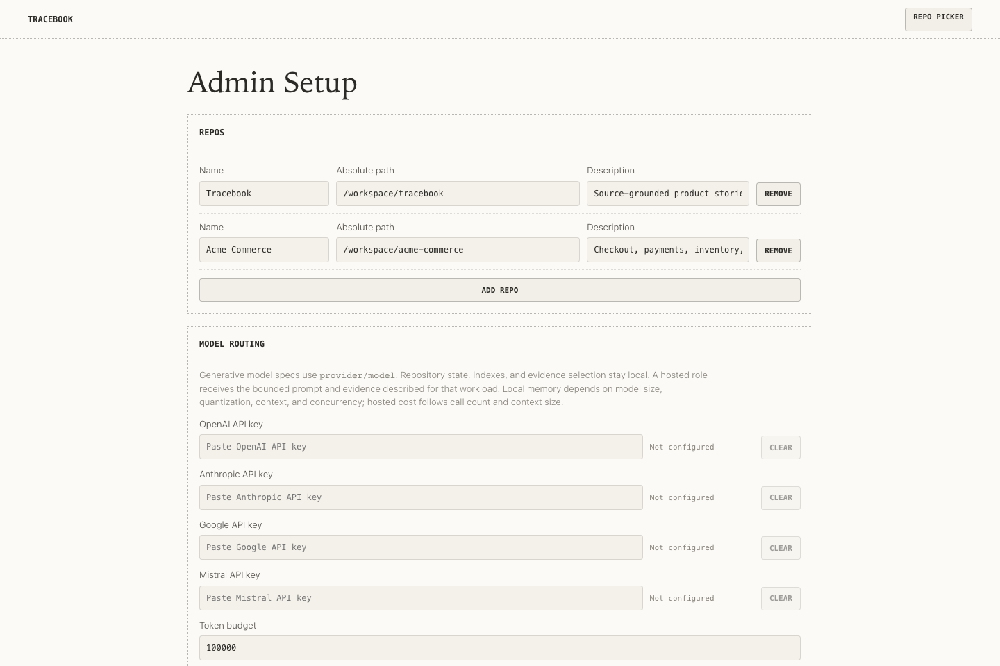

# Configuration

`/admin` is Tracebook's authoritative product configuration surface. It generates and updates the effective non-secret configuration rather than asking users to assemble environment files by hand.

Start the application:

```sh
yarn dev
```

Open `/admin` at the local URL printed by Vite. The first saved configuration enables the repository picker and runtime.



*Admin Setup keeps the repository boundary and model routing visible in one product surface.*

## Configuration and Credentials

Non-secret settings are stored at:

```text
~/.tracebook/tracebook.config.json
```

The file includes configured repositories, model assignments, the Ollama endpoint, embedding and retrieval settings, indexing behavior, planner budgets, repository-tool limits, caches, and the token governor. Treat it as admin-generated product state. Saving `/admin` validates the effective settings, atomically replaces the file, reloads configuration, and disposes active repository runtimes so they reopen with the new values.

OpenAI, Anthropic, Google, and Mistral credentials are stored in the operating-system keychain through `@napi-rs/keyring`, under the `com.bandf.tracebook` service. They are never written to `tracebook.config.json`. The admin and configuration API expose only whether each credential exists and a short SHA-256 fingerprint, not the credential value.

Use the provider's **Clear** control and save the form to remove a credential.

`.env` files and general process-environment overrides are not part of the product configuration path. `PORT` and `HOST` are limited production-listener controls; `HOST` is accepted only when it resolves to `localhost`, `127.0.0.1`, or `::1`. Evaluation commands have their own explicitly documented environment controls.

## Generative Model Providers

Generative model specifications use `<provider>/<model-id>`.

Supported providers are:

- `openai`
- `anthropic`
- `google`
- `mistral`
- `ollama`

Hosted providers require the corresponding credential. Every `ollama/` specification uses the Ollama base URL saved in `/admin`. The default `http://127.0.0.1:11434` addresses Ollama on the same machine; another address sends Ollama requests to that configured host.

Tracebook validates model assignments when configuration is saved. The exploration model must support tool calling. Ollama models required by the effective configuration are checked at runtime startup, missing models are pulled automatically, and the configured Ollama exploration model is checked for an advertised tools capability. Tracebook also rejects model families whose provider-level reasoning cannot be disabled, because the planner—not an opaque model reasoning mode—owns the explicit exploration, coverage, outline, and synthesis phases.

## Model Roles and Data Received

The admin assigns models by workload. Call frequency and context volume are more useful selection inputs than a generic local-versus-hosted label:

| Setting | Work and cadence | Model input | Selection pressure |
| --- | --- | --- | --- |
| Exploration model | Iterative investigation for each non-fast-path question | Question and bounded story context, locally prefetched evidence, similar-trace context, and bounded repository search/read/list/grep results | Must support tools. Reasoning quality improves coverage; step count multiplies latency and hosted cost. |
| Outline model | Plans the chapter and performs bounded coverage decomposition; also supports change-brief generation | Question or change intent, the selected evidence packet, and relevant story or trace context | Structured planning and source selection matter more than prose style. |
| Synthesis model | Produces each planned story component, with components running at bounded concurrency | One component plan and its evidence slice | Aggregate work scales with component count. Larger models increase local memory pressure or hosted cost and latency. |
| Annotation model | Selects and explains load-bearing lines in an annotated excerpt | The selected source excerpt and its evidence context | Source-focused structured calls, normally smaller than exploration or synthesis. |
| HyDE model | Conditionally expands a query when initial retrieval is weak | The current retrieval question | One short, latency-bounded call. It does not receive repository evidence. |
| Enrichment model | Generates one product-language description for each new or changed source file when enabled | Relative file path and at most the configured maximum number of source characters | Potentially high-volume during an initial index; the default is the local `ollama/qwen3-coder-next:latest`. |
| Eval fast model | Runs reduced generation-evaluation paths | Evaluation prompts, fixtures, and the evidence produced by that evaluation run | Does not serve ordinary product questions; prefer an inexpensive local model. |

If one of these roles is assigned to a hosted provider, the provider necessarily receives the bounded input described in its row. It does not receive an automatic repository mirror and does not become Tracebook's search or persistence layer.

## Embeddings, Reranking, HyDE, and Enrichment

These settings affect retrieval at different stages:

- **Embedding model** encodes every indexed chunk and each search query. A bare Hugging Face model id runs in-process through Transformers.js and ONNX Runtime. An `ollama/` prefix uses the configured Ollama embedding endpoint. Hosted generative providers are not embedding targets.
- **Embedding dimensions** must match the selected model's output width. Batch size, dtype, thread count, query/document prefixes, and the in-memory embedding cache tune resource use and model behavior.
- **Reranker** runs a local Hugging Face cross-encoder over the leading hybrid-search candidates. Ollama rerankers are not supported because Ollama has no reranking endpoint.
- **HyDE** makes one short configured-model call only when initial similarity is below the configured threshold, then embeds the hypothetical answer on the document side.
- **File enrichment** runs once for every new or changed supported file when enabled. Failures degrade to an empty description and are counted in runtime/index health rather than blocking the rest of indexing.
- **Dependency documents** synthesize local virtual descriptions from supported dependency manifests. They do not copy or index installed dependency trees.

Local Hugging Face embedding and reranking weights are cached under `~/.bandf/models` and downloaded on a cache miss. Ollama keeps its models in its own store. Runtime startup reports model pulls, weight downloads, loading, and warmup through the indexing/status UI.

## Settings That Rebuild Indexed Content

Tracebook fingerprints the implemented settings that identify stored chunks and vectors. Changes to the embedding model, dimensions, dtype, document prefix, chunking settings, enrichment enablement/model, or versioned indexing schemes cause the affected index to rebuild cleanly. Changing query-side behavior, embedding batch/thread/cache settings, enrichment limits or concurrency, reranking, search thresholds, planner limits, or presentation does not regenerate existing source chunks; those settings take effect on subsequent applicable work.

Embedding model and dimension changes also select a separate `<embedding-signature>` directory below the repository's index root. The remaining index-affecting settings are enforced by metadata and content fingerprints inside that index.

## Repositories and Local State

Add repositories by absolute path in `/admin`, choose the default, and switch among them through `/repos`. Tracebook validates that a selected path exists, is a readable directory, and remains within the source-access policies before the runtime uses it.

Repository-specific state is isolated under:

```text
~/.tracebook/data/repos/<repo-hash>/
```

Each repository has independent indexes, traces, stories, change briefs, answer-cache state, source revisions, and file watchers. Saving configuration disposes all active repository runtimes; they are recreated lazily from the new configuration.

## Advanced Controls

The advanced admin settings fall into five practical groups:

- **Retrieval:** semantic threshold, returned content limit, fast-path gates, HyDE threshold and timeout, reranker candidates, and similar-trace limits.
- **Generation:** token-per-minute budget, exploration step/time/token limits, outline and component budgets, component concurrency, annotation budget, and trace component count.
- **Indexing:** embedding execution, dependency documents, enrichment, chunk windows, and watcher debounce behavior.
- **Repository tools:** maximum read lines, list entries, grep matches, line length, and timeout.
- **Local caches and history:** answer-cache capacity/TTL and trace retention/search behavior.

The admin displays the effective defaults alongside these controls. Resource pressure is workload-specific: model size, quantization, context length, concurrency, repository size, and enabled indexing features are more meaningful than one generic memory estimate.

See [Architecture](architecture.md) for the complete runtime and network boundary, and [Indexing](indexing.md) for corpus and invalidation behavior.
