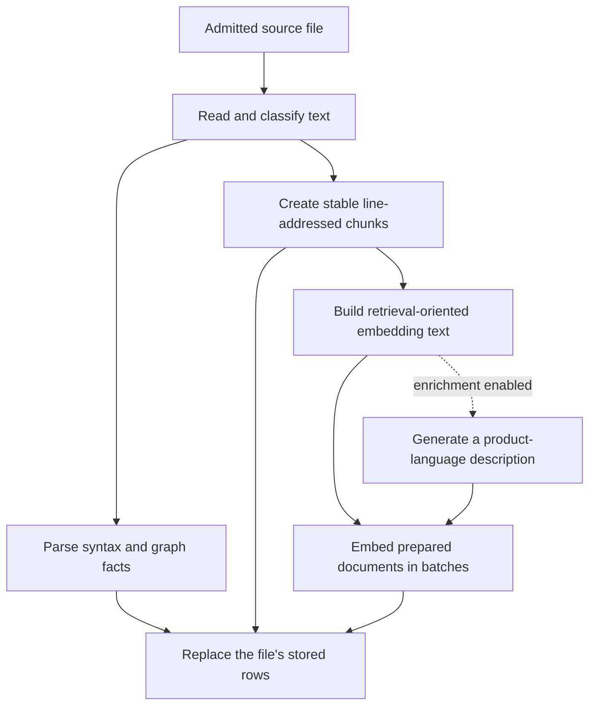
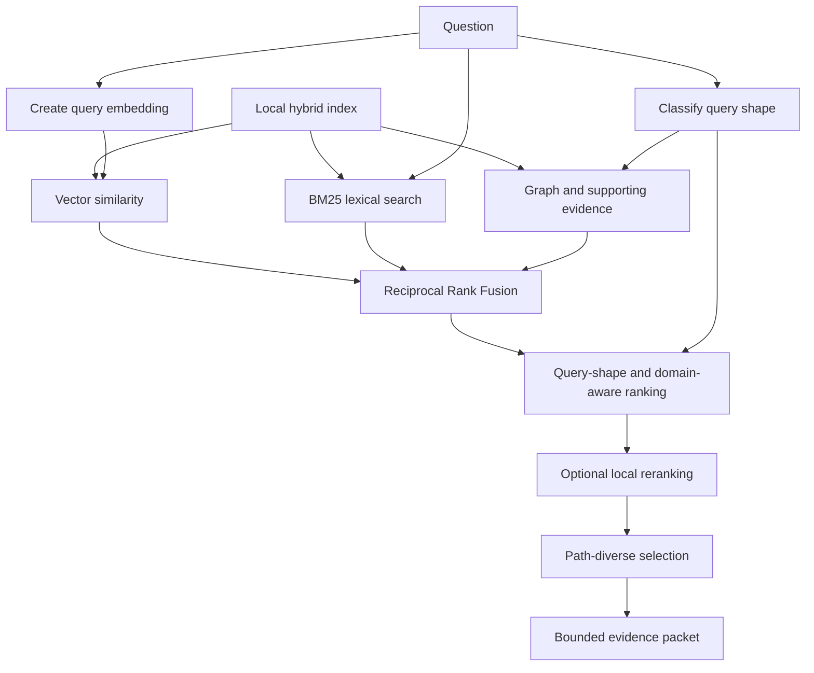

# Indexing

Tracebook builds a repository-specific hybrid index that combines source chunks, vector embeddings, BM25 full-text search, parser-derived graph facts, and optional dependency and enrichment documents. The index is local and exists to construct bounded evidence packets; it is not a replacement for the repository itself.

## First Run and Reuse

The first time a repository is selected, its runtime discovers the eligible corpus, acquires or loads the configured local search models, opens the LanceDB store, and indexes the source. The browser shows each startup stage and blocks questions until the runtime is ready.

Later runs reuse stored rows. Per-file content hashes avoid parsing and embedding unchanged files, while the watcher incrementally handles additions, changes, and removals. A burst of edits is debounced and store optimization is deferred until writes settle.

Index, trace, story, and change-brief state is isolated under:

```text
~/.tracebook/data/repos/<repo-hash>/
```

Embedding model and dimension changes select a separate index directory beneath that repository root.

## Corpus Policy

The same source-corpus policy governs initial discovery, incremental indexing, model-visible tools, and full-source preview. A candidate must:

- normalize to a repository-relative path;
- remain physically inside the configured repository;
- match a registered source or repository-artifact type;
- survive the hard exclusion rules and repository ignore rules;
- be a regular, non-symlinked file;
- be no larger than 1 MB; and
- pass a lightweight binary-content check.

Markdown documentation and supported manifests/configuration files are admitted alongside program source. The current language registry covers Bash, C, C++, C#, CSS, Emacs Lisp, Elixir, Go, HTML, Java, JavaScript, JSON, Kotlin, Lua, Objective-C, OCaml, PHP, Python, ReScript, Rust, Scala, Solidity, SystemRDL, TLA+, TOML, TSX/JSX, TypeScript, YAML, and Zig.

## Ignore Rules

Tracebook reads gitignore-syntax policy from:

- built-in defaults;
- `.gitignore`;
- `.git/info/exclude`;
- `.ignore`;
- `.rgignore`;
- `.fdignore`; and
- `.tracebookignore`.

Built-in **hard exclusions** cover version-control internals, dependency installs, caches, IDE state, secrets, logs, compiled artifacts, lockfiles, and language build/cache directories. They cannot be re-included.

Built-in **soft defaults** omit common tests, fixtures, generated/build output, coverage, a top-level `data/` directory, and license boilerplate. Repository ignore files are higher precedence, so a `!negation` in `.tracebookignore` can re-include a soft-default path when its file type is otherwise supported. This lets a repository make its own corpus decision without weakening the hard source and secret boundary.

Changing any recognized ignore file invalidates the cached policy and triggers a complete corpus reconciliation. Adding `.tracebookignore` is therefore enough to change Tracebook's index without restarting the process.

## Per-file Processing

An admitted physical file moves through this pipeline:



Small files remain intact where possible; larger files use overlapping line windows with character-level protection for very long spans. Every source chunk retains its repository-relative path, line range, kind, language, content hash, and retrieval text.

Language integrations own their extensions, parser grammar, source policy, dependency manifests, annotation semantics, and repository-specific vocabulary. The shared parser layer turns language facts into a common graph vocabulary so retrieval can reason about routes, entrypoints, imports, definitions, configuration, persistence, and other cross-language roles.

## Dependency Documents

Enable **Index dependency docs** in `/admin` to generate virtual documents under paths such as:

```text
__dependencies__/npm/hono.md
```

These documents summarize declared runtime dependencies from supported manifests. They give retrieval library and version context without scanning `node_modules`, `vendor`, or other installed dependency trees. Changing a relevant manifest refreshes the virtual dependency set.

## File Enrichment

When enabled in `/admin`, enrichment generates one short product-language description for each new or changed supported file. The configured model receives only the repository-relative path and at most **Max input chars** of source. The description is indexed alongside the code so a product-language question can match a file whose identifiers use different vocabulary.

Enrichment is concurrent but separately bounded from parsing and embedding. A failed or timed-out call produces no description for that file rather than failing the entire index. Attempted and successful counts are exposed through runtime health and corpus-coverage data so a broken enrichment model is visible.

Because enrichment can run once per file during a cold index, its execution location matters materially. The shipped default is the local `ollama/qwen3-coder-next:latest`; assigning a hosted model sends each bounded enrichment input to that provider.

## Hybrid Retrieval

Each search begins with a query embedding and can use several retrieval legs:

1. dense vector similarity over indexed documents;
2. native BM25 full-text search for identifiers and exact anchors;
3. parser-derived graph relationships and structural neighbors;
4. supporting documentation, configuration, and dependency evidence when the question calls for it; and
5. optional local cross-encoder reranking over the leading candidates.

The independent retrieval legs converge before Tracebook constructs the evidence packet used by the planner:



Vector and lexical rankings are combined with Reciprocal Rank Fusion. Query-shape policy determines which domain and graph refinements help a product-language, identifier, or relational question. Result selection then applies path diversity so one file does not consume the entire evidence packet.

The vector similarity is retained after fusion because the planner uses it to decide whether a narrow question qualifies for the fast path and whether a weak initial search should invoke HyDE. Reranking changes order but not the underlying similarity used by those gates. If reranking fails, retrieval keeps the fused order.

## Fingerprints and Source Revisions

Two fingerprints solve different problems:

- The **index fingerprint** identifies behavior that changes stored chunks or vectors: indexing and lexical scheme versions, chunk settings, source-graph and embedding-text versions, file-size policy, enrichment enablement/model, and embedding model, dimensions, dtype, and document prefix.
- The **source revision** hashes the sorted set of indexed repository paths and their content hashes. It identifies the source state against which an answer was produced.

An index-fingerprint mismatch invalidates stored content hashes so eligible files are rebuilt. During a full rebuild the source revision is deliberately unavailable, preventing answer-cache reads or writes against a partial index. The completed index publishes a new revision.

Incremental file changes update the affected rows and advance the revision. Saved stories also retain source fingerprints for the files they cite, allowing the UI to identify exactly which sources became stale and offer regeneration.

## Limits and Diagnostics

- Physical source files larger than 1 MB are skipped.
- Full-source preview applies the same 1 MB limit before returning a body.
- `read_file` reads requested line slices and enforces the configured maximum line count.
- Search results clip included source text to the configured content budget.
- Binary, excluded, unsupported, or unreadable files are counted by reason in corpus coverage.
- Enrichment coverage is reported independently from basic source coverage.

Use [Retrieval evaluation](retrieval-eval.md) before and after changes to corpus policy, embedding text, search fusion, graph facts, reranking, HyDE, or enrichment. See [Architecture](architecture.md) for the complete runtime lifecycle.
