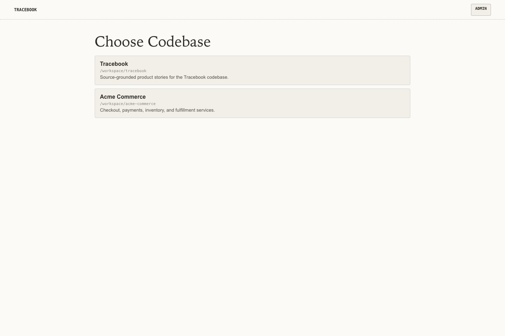
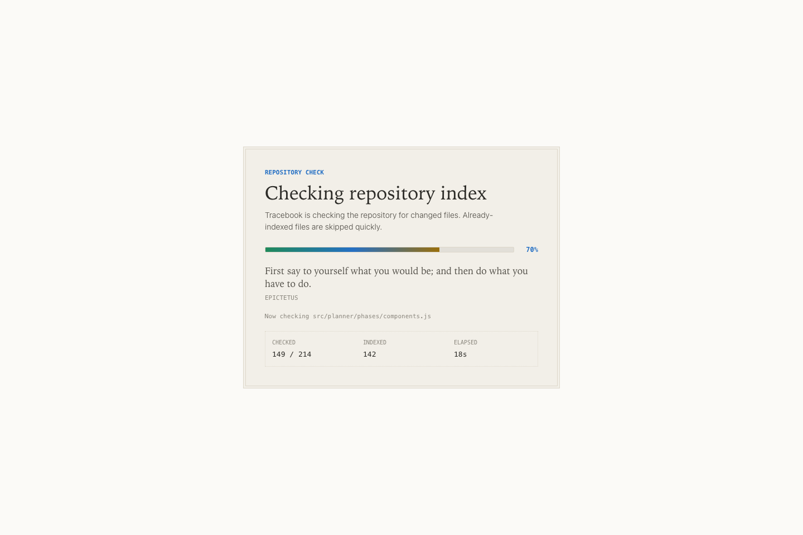
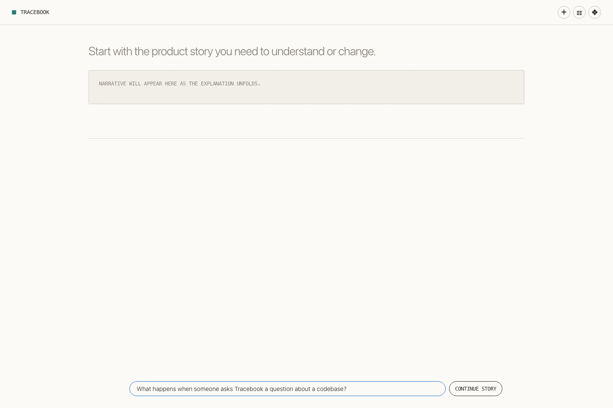
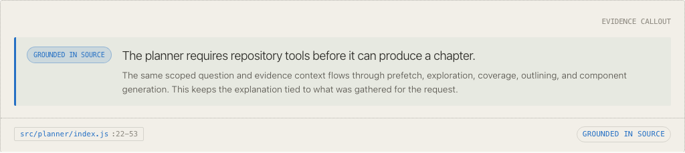
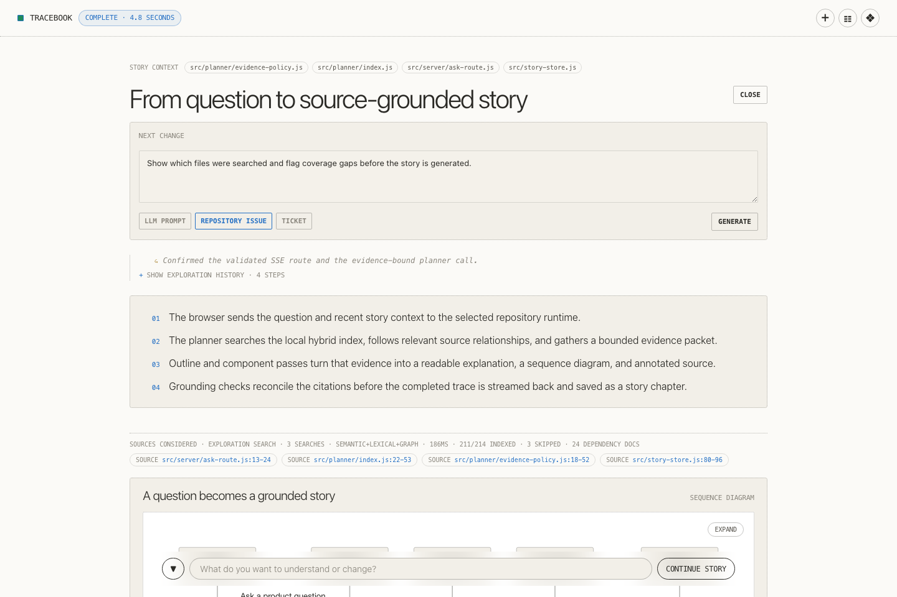
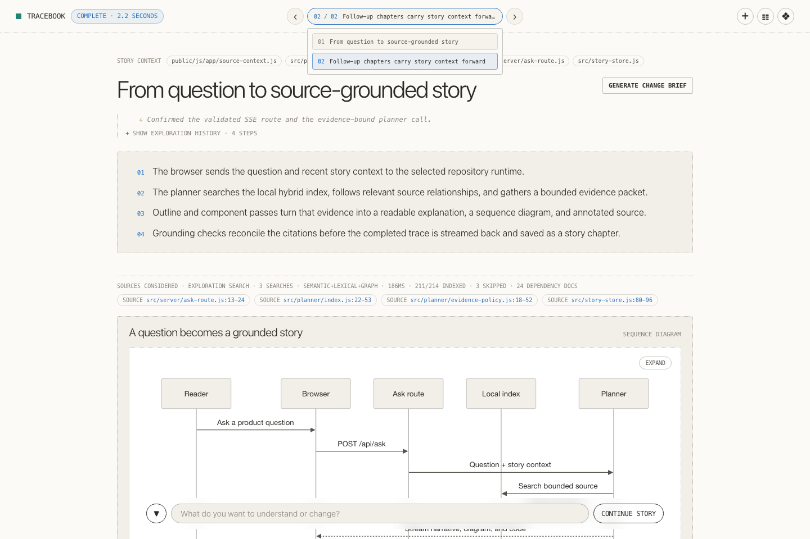
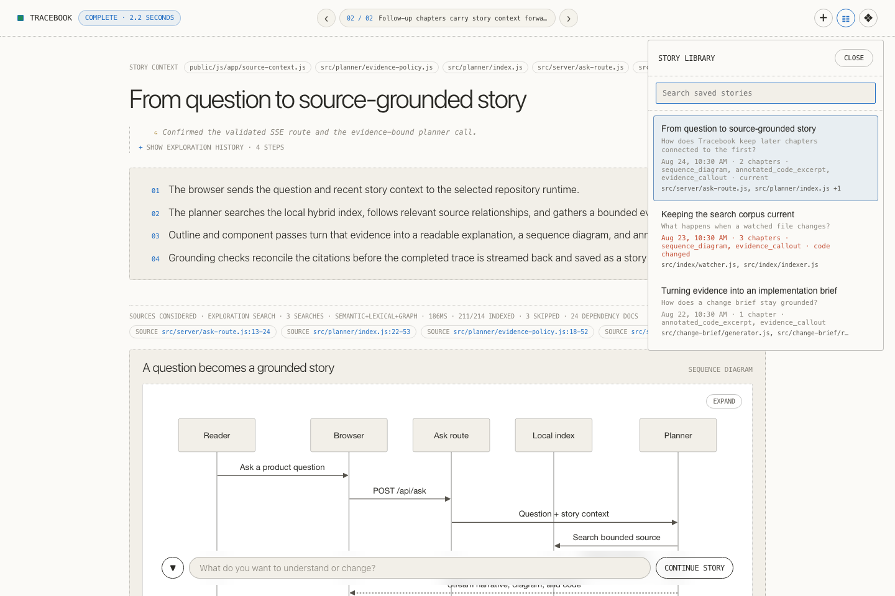

# Tracebook Product Walkthrough

Tracebook turns a codebase into source-grounded product stories: readable explanations, diagrams, and annotated code backed by the files in the repository.

This walkthrough follows one question from setup through a saved story and a Change Brief. The example asks how Tracebook itself turns a question into a grounded story, but the same workflow applies to customer journeys, operational behavior, unfamiliar subsystems, and proposed product changes.

The screenshots use deterministic example data and the Daylight theme. Repository paths are illustrative; the screens and interactions come from the real Tracebook UI.

## 1. Configure the repositories and model roles

Open `/admin` before exploring a codebase. The Admin Setup page defines the local repositories Tracebook can read and the model assigned to each generative workload.


Add each repository with an absolute path. A repository is an explicit boundary: it receives its own index, stories, traces, and Change Briefs. The page also shows which work is assigned to Ollama and which work may use a hosted provider. Provider credentials are stored separately from the non-secret configuration.

The configuration matters because Tracebook keeps repository analysis local while allowing each organization to choose the model and cost profile for generation. See [Configuration](configuration.md) for every role, setting, and data boundary.

## 2. Choose the codebase to explore

Open `/repos` or use **Back to repositories** from Admin Setup. Select a configured repository to enter its workspace.



The picker makes the active source boundary visible before a question is asked. That is especially useful when several services or products have similar vocabulary: the answer should be grounded in the intended codebase, not in an accidental mixture of repositories.

Use **Admin setup** to add or edit repositories. Selecting a card opens that repository's root workspace.

## 3. Let Tracebook build local context

On the first visit, Tracebook parses the selected repository and builds its local hybrid search index. The indexing overlay reports the repository path, phase, progress, files checked, files indexed, and elapsed time.



Wait for the runtime to become ready before asking a question. Later starts reuse persisted rows, and the file watcher updates changed source incrementally. Dependency documents can inform retrieval without being treated as first-party source.

The visible counts are useful operational evidence: they show what corpus Tracebook actually prepared, rather than asking the user to assume that every file was available. [Indexing](indexing.md) explains exclusions, supported languages, dependency documents, and retrieval policy.

## 4. Ask in product language

Once the index is ready, the workspace presents a single question composer. Ask about behavior, a user journey, an architectural boundary, or a change you are considering. You do not need to know the filename first.



The example asks:

> What happens when someone asks Tracebook a question about a codebase?

Specific questions tend to produce the most useful stories. Name the actor, behavior, or boundary you care about; include constraints when they matter. Tracebook searches the selected repository, gathers bounded evidence, and streams the resulting chapter into the page.

This is the first organizational benefit of the workflow: a product manager, support engineer, designer, or new developer can begin with the behavior they need to understand. The system connects that vocabulary to source, while keeping the resulting explanation checkable by someone closer to the code.

## 5. Read the source-grounded chapter

A completed answer is a story chapter, not a disposable chat bubble. The chapter combines a title, a numbered narrative, exploration history, source coverage, cited ranges, and generated visual components.


Read the page from the outside in:

- **Story context** at the top records source carried into the current chapter.
- **Exploration history** can be expanded to inspect the searches and repository operations used to gather evidence.
- The **numbered narrative** explains the behavior in product-readable steps.
- **Sources considered** reports search strategy and corpus coverage, followed by the cited source ranges.
- **Generate Change Brief** turns the chapter's understanding into a structured implementation handoff.

Coverage is a corpus-level signal, not proof that every relevant file was retrieved. Tracebook keeps the counts and citations visible so readers can judge the scope of the answer and investigate further when the stakes are high.

## 6. Follow behavior across boundaries with diagrams

Chapters can include Mermaid diagrams when relationships are clearer visually. This sequence diagram follows a question through the browser, ask route, local index, and planner.


Use **Expand** for a larger view. Source chips beneath the diagram open the cited ranges, and the evidence label distinguishes a diagram directly stated by source from one assembled as an inference across several files.

For teams, diagrams provide a compact shared model of behavior that often spans frontend, backend, retrieval, and model boundaries. The citations keep the diagram connected to implementation instead of letting it become an untraceable architecture sketch.

## 7. Inspect annotated source

Annotated code excerpts place the relevant source beside plain-language callouts. The code is shown verbatim with repository line numbers; the annotation explains why a range matters to the story.


Use the source chip in the component footer to open the full file. The grounding badge records whether the excerpt still matches the source revision associated with the story.

This view is intended to bridge different levels of technical depth. A reader can understand the product behavior from the annotation, while an engineer can immediately verify the claim against the exact lines and surrounding control flow.

## 8. Separate evidence from inference

Evidence callouts make the chapter's confidence legible. In this example, the statement is marked **Grounded in source** and cites the planner range that supports it.



Tracebook uses three important distinctions throughout generated components:

- **Grounded in source** means the claim is directly supported by cited repository evidence.
- **Inferred from evidence** means the claim is a reasoned synthesis of the cited source, not a literal statement found in one range.
- **Evidence gap** means the available corpus did not support the requested claim strongly enough.

These labels do not eliminate judgment. They make the judgment visible, which is more useful in review, onboarding, incident follow-up, and planning than an answer that presents every sentence with the same confidence.

## 9. Open the full source context

Click a source chip anywhere in a chapter to open the file viewer. The cited range is highlighted while the surrounding file remains available for context.


Use **Collapse** to return to the story. **Copy Image** renders the expanded source as a themed PNG in the browser, which is useful when a line-level explanation needs to travel into a review, issue, design note, or presentation without losing its citation context.

Opening the full file is an important part of the trust model. A generated explanation should shorten the path to the relevant source, not prevent a reader from examining it.

## 10. Describe the change you want

When a chapter has established current behavior, select **Generate Change Brief**. Enter the desired change and choose an output format: **LLM Prompt**, **Repository Issue**, or **Ticket**.



The chapter is already the source context for the brief; the text box is for the change intent that is not present in the current implementation. A useful pattern is to restate or adapt the chapter title, then add the outcome, constraint, or gap you want addressed.

In the example, the instruction is:

> Show which files were searched and flag coverage gaps before the story is generated.

Choose the format based on the next handoff. The underlying analysis remains source-grounded, while the final section is shaped for a coding model, repository issue, or work-tracking ticket.

## 11. Review and copy the Change Brief

The generated brief converts understanding into structured change intent. It records the product goal, current behavior, likely files and their roles, acceptance criteria, risks, open questions, and a copyable output in the selected format.


Review the likely files and confidence cues before copying the output. Use **Re-generate** after editing the intent or selecting another format. The brief is a planning and handoff artifact; it does not modify the repository or replace engineering review and tests.

This is where the product story becomes practical for modern delivery teams. Product intent, observed behavior, likely implementation surface, and unresolved risk remain in one traceable artifact instead of being reconstructed independently in a ticket, a chat thread, and a coding-model prompt.

## 12. Continue the story with follow-up chapters

After the first answer, the composer changes to **Continue Story**. Ask a narrower or adjacent question and Tracebook creates another chapter with bounded context from the existing story.



The chapter control in the top bar shows the current position and lets you move between chapters. Use the arrows for sequential navigation or open the chapter menu to jump directly to a title. The **plus** action starts a separate story when the new question should not inherit the current thread.

Follow-ups preserve the reasoning path behind an investigation. A team can begin with a product journey, drill into a boundary or failure mode, and then create a Change Brief without losing which earlier question supplied the context.

## 13. Reopen saved work from the Story Library

Open the list action in the top bar to view the Story Library. Search by title, question, source path, or other visible story metadata, then select an item to reopen it.



Each row summarizes the most recent question, chapter count, generated component types, and cited source. Stories whose cited source has changed are marked so that an old explanation is not mistaken for a current one. A story can be deleted with the row's delete control and confirmation when it is no longer useful.

Persistence gives the system organizational value beyond a single answer. Investigations can become durable, reviewable product knowledge while still retaining the source ranges and freshness signals needed to challenge that knowledge later.

## A practical team workflow

A lightweight organizational workflow looks like this:

1. **Discovery:** ask a product-language question about current behavior.
2. **Verification:** inspect coverage, evidence labels, diagrams, and cited source with an engineer or domain owner.
3. **Alignment:** continue the story until the relevant boundaries and gaps are explicit.
4. **Handoff:** generate a Change Brief in the format used by the receiving team or coding model.
5. **Maintenance:** reopen the saved story later and respond to source-change warnings rather than treating old documentation as timeless.

Tracebook does not make generated explanations authoritative merely because they contain citations. Its value is the shorter, explicit path between an organizational question and the repository evidence used to answer it. That can reduce the amount of undocumented context people must carry while leaving verification, design judgment, implementation, and testing where they belong.

## Rebuild the screenshots

The walkthrough images are captured from the built client with deterministic documentation fixtures. No configured model or provider call is required.

```sh
yarn docs:screenshots
```

The command overwrites `docs/images/product-walkthrough/`. The capture workflow lives in `scripts/capture-product-walkthrough.js`; it exists only to keep this guide reproducible as the interface changes and is not part of the production runtime.

For the product rationale and system boundaries, continue with [Design and Purpose](design-and-purpose.md) and [Architecture](architecture.md).
